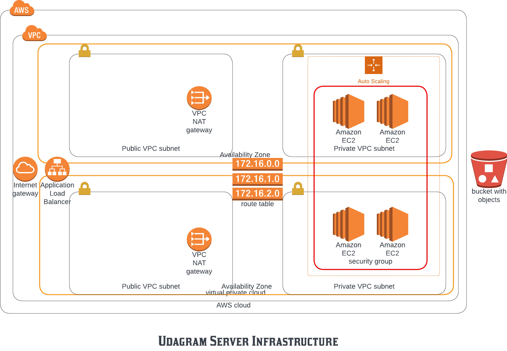
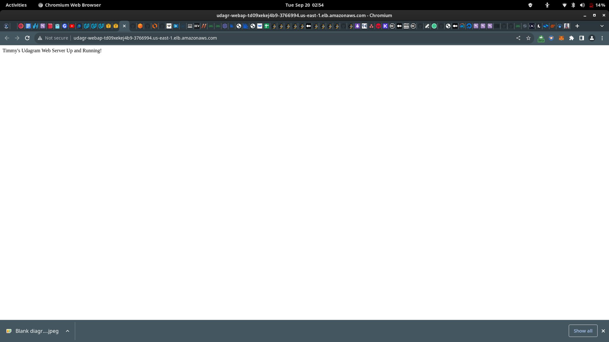

### Deploy a high-availability web app using CloudFormation

An infrastructure-as-Code project where I deploy a highly availabl;e web server in the cloud using AWS CloudFormation.

#### Udagram Infrastructure Diagram

#### Outputs

- Load Balancer DNS: [http://udagr-webap-1bm1gglt88f2m-1360665967.us-east-1.elb.amazonaws.com/](http://udagr-webap-1bm1gglt88f2m-1360665967.us-east-1.elb.amazonaws.com/)
- Jump Box Server: [http://ec2-107-21-156-55.compute-1.amazonaws.com/](http://ec2-107-21-156-55.compute-1.amazonaws.com/)

#### Display in browser to confirm success

